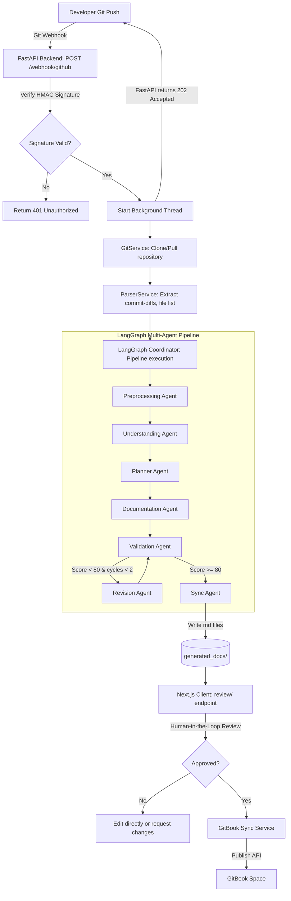
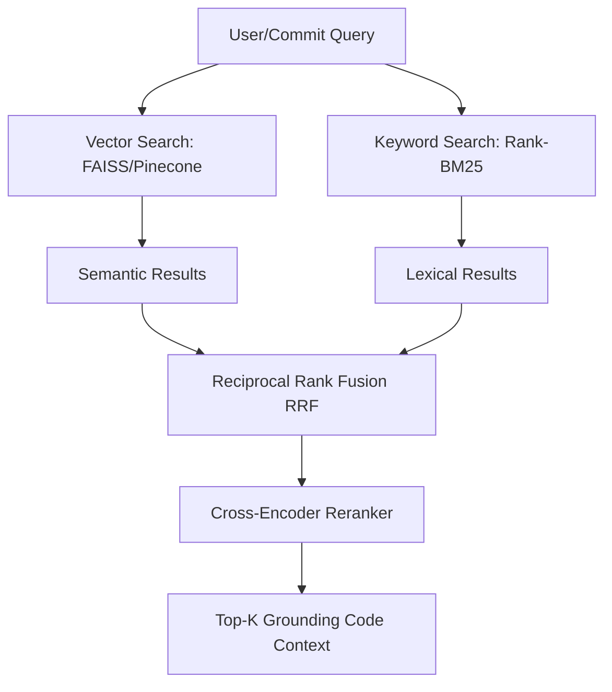
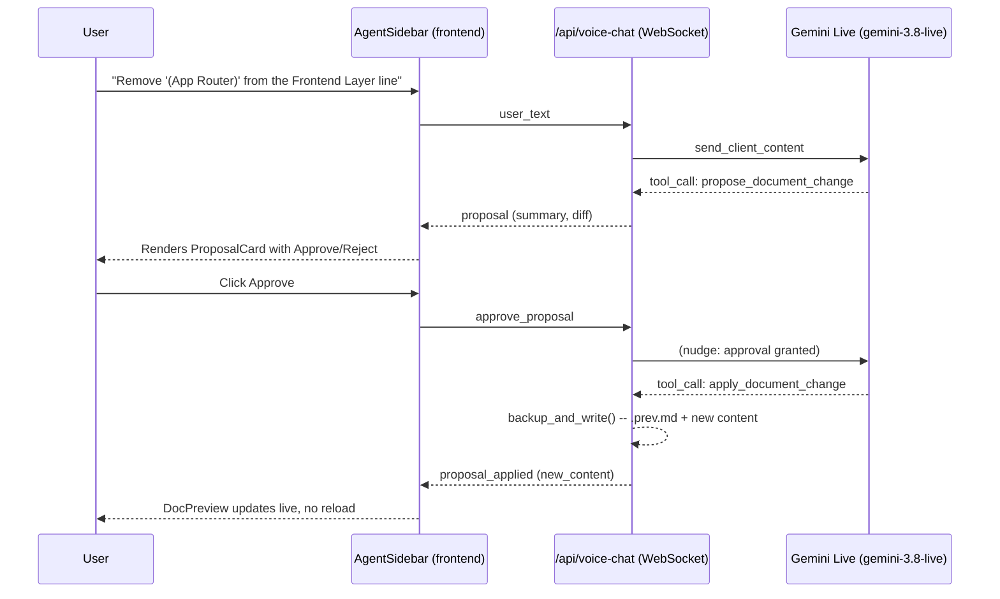

# DocuBear: Technical Architecture & System Reference

DocuBear is an autonomous, multi-agent, Retrieval-Augmented Generation (RAG) grounded system designed to automatically analyze repositories and keep their technical documentation (such as READMEs, Architecture overviews, Changelogs, and Security guidelines) synchronized and accurate. 

It consists of two main components:
1. **FastAPI + LangGraph Backend**: An AI agent pipeline orchestrated via LangGraph and backed by a hybrid vector-keyword retrieval engine.
2. **Next.js 16 Frontend**: A dashboard providing human-in-the-loop validation, live knowledge base management, commit history mapping, and GitBook synchronization.

Alongside the push-triggered pipeline above, DocuBear also exposes a
persistent **documentation chatbot and voice assistant** — a sidebar,
present on every page, that answers questions grounded in a repository's
docs and RAG code context, and can draft and (after explicit human
approval) apply edits to the document currently open in the viewer, by
text or by voice (Gemini Live). See §7 and
[CHATBOT_AND_VOICE_ASSISTANT.md](CHATBOT_AND_VOICE_ASSISTANT.md) for the
full design.

---

## 1. System Architecture Overview

DocuBear sits between code changes (GitHub push webhooks) and final documentation portals (GitBook, markdown folders). The following diagram describes the complete end-to-end data flow:

---

## 2. Technology Stack & Frameworks

### Backend Technologies (Python 3.12+)
*   **FastAPI (0.115.6)**: Serves as the web framework, providing high-performance, asynchronous REST endpoints for GitHub webhooks, the RAG engine, document tracking, and GitBook configurations.
*   **Uvicorn (0.32.1)**: Runs the ASGI web server.
*   **LangGraph (0.2.0+)**: Models the multi-agent pipeline as a compiled stateful Directed Acyclic Graph (DAG) with cycles, controlling routing, validations, and self-correction loops.
*   **LangChain Core / Community (0.3.0+)**: Wraps LLM interactions, handling prompt layouts and standardized streaming and structured outputs.
*   **Pydantic v2 (2.10+)**: Handles data parsing, validation, settings, and JSON serialization.
*   **GitPython (3.1.43)**: Powers local workspace management, handling repository cloning, branch switching, and pull/diff operations.
*   **FAISS-CPU (1.7.4+)** & **Pinecone (3.0.0+)**: Hybrid vector database providers. FAISS runs locally for offline development; Pinecone handles scalable cloud deployments.
*   **Sentence-Transformers (2.2.2+)**: Provides local word/sentence embeddings (e.g., `all-mpnet-base-v2`) to compute semantic similarities for code context.
*   **Tree-sitter (0.21.0+)**: Parses codebase files into Abstract Syntax Trees (AST) to enable precise, language-aware syntax chunking (for Python, Java, JavaScript, and TypeScript).
*   **Rank-BM25 (0.2.2+)**: Runs lexical, keyword-based search to complement semantic vector search.
*   **Pytest (8.3.4)** & **Pytest-Asyncio**: Powers the asynchronous unit testing suite, mocking Git operations, RAG queries, and LLM completions.
*   **google-genai (2.19.0+)**: The Gemini Live API SDK powering the voice assistant's real-time, bidirectional audio/text/tool-calling session (`gemini-3.8-live`) — separate from `langchain-google-genai`/`google-generativeai`, which back the plain-text LLM calls elsewhere in the backend.

### Frontend Technologies (Next.js 16 / React 19)
*   **Next.js (16.2.11 - App Router)**: Framework for server-rendered page routing, performance, and API route management.
*   **React (19.2.4)** & **React-DOM**: UI library implementing concurrent rendering and hooks.
*   **Tailwind CSS (4.3.3)**: A utility-first CSS engine styling the responsive layout, supporting dark mode themes and modern utility sets.
*   **Framer Motion (13.1.1)**: Orchestrates micro-interactions, layout page fades, and dashboard stats counts.
*   **Mermaid (11.17.2)**: Parses and visualizes dependency graphs, state diagrams, and workflow sequences directly inside markdown files.
*   **React Markdown (10.1.0)** & **Remark-GFM**: Renders GitHub Flavored Markdown (tables, checklists, auto-links) in the browser.
*   **Diff (9.0.0)** & **@types/diff**: Calculates text diffs to display side-by-side git-like code comparisons during review.

---

## 3. The LangGraph Multi-Agent Pipeline

The backend utilizes an orchestrator coordinator (`agents/coordinator/coordinator.py`) which manages shared states within a standard `TypedDict` and structures agent runs as follows:

| Agent | Purpose | Framework / Logic | Input | Output |
|---|---|---|---|---|
| **1. Preprocessing** | Walks the repository folder tree, calculates size statistics, checks entry-points, identifies configuration files, and analyzes programming languages. | Pure Python (os.walk, pathlib); no LLM. | Clone path | Directory trees, framework listings, file maps (`metadata`) |
| **2. Understanding** | Analyzes the project's folder layout, structural API endpoints, and internal module relationships. Uses RAG-grounded data to map the domain. | LangChain LLM + RAG Service context. | Directory tree + metadata | Architectural class, service boundaries, endpoint maps (`understanding`) |
| **3. Planner** | Groups project folders, prioritizes file-by-file reviews, and defines structural parameters. (Runs as an isolated step in graph nodes). | Rule-based structure. | Understanding metadata | Structured task plan |
| **4. Documentation** | Generates detailed technical documents (e.g., README.md, ARCHITECTURE.md, SECURITY.md, CHANGELOG.md) based on code updates. | LangChain Chat LLM. | Code chunks + RAG + Understanding | Draft markdown documents (`documentation`) |
| **5. Validation** | Evaluates generated documents based on rule metrics: completeness, formatting structure, semantic accuracy, and hallucination checks. Computes a quality score (0-100). | LLM evaluator + regex structure. | Draft markdown | Validation scores, issue listings (`validation`) |
| **6. Revision** | If the Validation score falls below 80, the Revision Agent takes the generated feedback, isolates the source files, modifies the markdown, and resubmits to Validation. | LangChain Chat LLM. | Draft markdown + Validation issues | Revised markdown documents (`revision`) |
| **7. Sync** | Saves approved markdown documents to the file system, registers them to database records, and terminates the active process. | Pure Python filesystem operations. | Approved markdown | Saved files in `generated_docs/` |

### Self-Correction & Flow-Control
The Coordinator executes conditional routing logic on completion of the Validation node:
*   If **Validation Score $\ge$ 80**: Route to **Sync**.
*   If **Validation Score $<$ 80** and **Revision Cycles $<$ 2**: Route to **Revision**, apply corrections, and route back to **Validation**.
*   If **Validation Score $<$ 80** and **Revision Cycles $\ge$ 2**: Terminate with a `FAILED` state to let a human resolve formatting or semantic errors directly.

---

## 4. The Retrieval-Augmented Generation (RAG) Engine

The RAG engine (`rag/` folder) guarantees that the LLM drafts and updates documentation using the actual codebase contents, instead of making inferences or guessing.

### Code Processing & AST Chunking
1.  **AST Parsing**: Instead of doing simple character-count or line-count slicing, DocuBear uses `tree-sitter` to parse file structures.
2.  **Semantic Boundaries**: It identifies functional boundaries (such as functions, classes, and method definitions) in Python, Java, JavaScript, and TypeScript, chunking code at these conceptual boundaries.
3.  **Context Enrichment**: Each chunk is annotated with metadata, including file path, enclosing class names, functions, import directives, and local dependencies.

### Indexing Pipeline
*   **Bootstrap Indexing**: When a repository is first added to the Knowledge Base, the RAG engine clones the code, chunks all supported source files, computes embedding vectors, and saves them into the vector database.
*   **Incremental Indexing**: On subsequent pushes, the system determines the list of added/modified/deleted files via Git logs. Only chunks belonging to modified or added files are re-processed, maintaining an up-to-date vector space without redundant computations.

### Hybrid Retrieval & Fusion
DocuBear retrieves relevant code context using a hybrid search mechanism to combine lexical and semantic features:

1.  **Semantic Retrieval**: Queries (such as commit diffs, modified filenames, or natural language prompts) are converted into vectors using a sentence transformer model (`sentence-transformers/all-mpnet-base-v2` or the Gemini Embeddings API).
2.  **Lexical Retrieval**: The query is searched against the chunk corpus using `Rank-BM25` to find exact keyword matches (such as class names, variables, or functions).
3.  **Reciprocal Rank Fusion (RRF)**: The results from both lists are combined using their rank positions:
    $$RRF\_Score(d \in D) = \sum_{m \in M} \frac{1}{k + r_m(d)}$$
    *(where $M$ includes both vector and keyword rankings, and $k \approx 60$).*
4.  **Cross-Encoder Reranker**: A lightweight cross-encoder model reranks the fused search results, scoring the semantic relevance of the code snippet relative to the query. Chunks below a relevance threshold are discarded, leaving only highly relevant code context to ground the LLM.

---

## 5. Directory Structure & Key Files

### Root Directory
*   [MENTOR_DEMO_PITCH.md](file:///Users/ashlin/Downloads/DocAgent-v1/MENTOR_DEMO_PITCH.md): Script walkthrough outlining the core product pitch, target demo flows, and feature validations.
*   [project_explanation.md](file:///Users/ashlin/Downloads/DocAgent-v1/project_explanation.md): This file (system architecture, technology configurations, and context overview).

### Backend Directory (`backend/`)
*   [backend/app/main.py](file:///Users/ashlin/Downloads/DocAgent-v1/backend/app/main.py): Entry point setting up the FastAPI app, CORS, directory lifecycles, and route registrations.
*   [backend/app/dependencies.py](file:///Users/ashlin/Downloads/DocAgent-v1/backend/app/dependencies.py): Houses the dependency injection bindings mapping configuration parameters to live service modules.
*   [backend/app/api/webhook.py](file:///Users/ashlin/Downloads/DocAgent-v1/backend/app/api/webhook.py): Exposes `POST /api/webhook/github`. Validates signatures using SHA-256 HMAC and triggers background threads to run the documentation pipeline.
*   [backend/agents/coordinator/coordinator.py](file:///Users/ashlin/Downloads/DocAgent-v1/backend/agents/coordinator/coordinator.py): Wires the `StateGraph` of the 7 LangGraph nodes, managing conditional edges and execution logs.
*   [backend/rag/pipeline/](file:///Users/ashlin/Downloads/DocAgent-v1/backend/rag/pipeline/): Orchestrates indexing, metadata cache mapping, database writes, and hybrid retrieval.
*   [backend/services/llm_service.py](file:///Users/ashlin/Downloads/DocAgent-v1/backend/services/llm_service.py): Manages LangChain bindings for model targets, model parameters, API key retrieval, and text generation.
*   [backend/services/chat_service.py](file:///Users/ashlin/Downloads/DocAgent-v1/backend/services/chat_service.py): Documentation chatbot — intent routing, RAG-grounded Q&A.
*   [backend/services/voice_session_service.py](file:///Users/ashlin/Downloads/DocAgent-v1/backend/services/voice_session_service.py) & [voice_tool_harness.py](file:///Users/ashlin/Downloads/DocAgent-v1/backend/services/voice_tool_harness.py): Gemini Live session + the propose/approve/apply editing gate. See §7.
*   [backend/app/api/voice_chat.py](file:///Users/ashlin/Downloads/DocAgent-v1/backend/app/api/voice_chat.py): `WS /api/voice-chat` — the voice/agentic assistant endpoint.

### Frontend Directory (`frontend/`)
*   [frontend/app/page.tsx](file:///Users/ashlin/Downloads/DocAgent-v1/frontend/app/page.tsx): Main dashboard displaying KPI summary stats (such as Connected Repos, Tracked Docs, Pending Updates) and dynamic recent document feeds.
*   [frontend/app/knowledge-base/page.tsx](file:///Users/ashlin/Downloads/DocAgent-v1/frontend/app/knowledge-base/page.tsx): Lists connected codebases, indexes code via vector database API integrations, and displays active chunk totals.
*   [frontend/app/review/](file:///Users/ashlin/Downloads/DocAgent-v1/frontend/app/review/): Provides visual diff components, layout models, markdown rendering options, and control systems to approve, comment, or modify generated documents.
*   [frontend/app/gitbook/page.tsx](file:///Users/ashlin/Downloads/DocAgent-v1/frontend/app/gitbook/page.tsx): Manages space identifiers, API tokens, webhook addresses, and synchronizes finalized documentation to GitBook.
*   [frontend/components/AgentSidebar.tsx](file:///Users/ashlin/Downloads/DocAgent-v1/frontend/components/AgentSidebar.tsx): The persistent chatbot/voice assistant sidebar, mounted once in the root layout. See §7.
*   [frontend/lib/agentContext.tsx](file:///Users/ashlin/Downloads/DocAgent-v1/frontend/lib/agentContext.tsx): Shared context letting any page tell the sidebar which document is open, without the sidebar living inside the page tree.

---

## 6. Academic & Research Context

DocuBear demonstrates several key concepts currently explored in Software Engineering and Artificial Intelligence research:

1.  **Multi-Agent Coordination (LangGraph DAGs)**: Rather than relying on a single, long-context prompt to write documentation, DocuBear breaks down the problem into specialised agents (Preprocessing, Understanding, Planning, Drafting, Validating, Revising). Each agent has a single responsibility, which minimizes context pollution, reduces hallucinations, and scales cost-effectively.
2.  **Self-Correction & Quality Gates**: The Validation-Revision loop acts as a programmatic Quality Gate. Validation metrics are quantified via structured LLM heuristics, mirroring test-driven compilation in code synthesis.
3.  **Hybrid RAG Retrieval Fusion**: By combining semantic embeddings (capturing intent and structural associations) with BM25 lexical keyword matching (capturing precise syntactic definitions, like function names), the system ensures high retrieval recall.
4.  **AST-Aware Chunking**: Traditional RAG systems slice documents at arbitrary character intervals, which splits code blocks in half. Chunking code via Abstract Syntax Tree (AST) node parsing ensures that functions and classes remain syntactically complete.
5.  **Incremental Vector Space Maintenance**: Updating a vector database on every commit is computationally expensive. DocuBear addresses this by executing delta-based incremental updates: calculating git diff changes and only rebuilding indices for updated or new source files.

---

## 7. Documentation Chatbot & Voice Assistant

Separate from the push-triggered pipeline above, a persistent sidebar
(mounted once in the frontend's root layout, so it survives page
navigation) provides two related capabilities:

*   **Read-only chat** (`POST /api/chat` → `ChatService`): answers questions
    grounded in a repository's generated docs and RAG-retrieved code
    context.
*   **Voice / agentic assistant** (`WS /api/voice-chat` → `VoiceSessionService`
    + Gemini's Live API, model `gemini-3.8-live`): the same grounded Q&A,
    plus the ability to draft an edit to the one document currently open in
    the viewer and apply it — but only after the human clicks **Approve** on
    the proposed diff. The approval check is enforced server-side
    (`voice_tool_harness.py`): the `apply_document_change` tool is refused
    with `not_yet_approved` unless a matching approval already arrived from
    an explicit UI click, regardless of what the user said out loud or
    typed.

A typed question gets a text-only reply; a spoken one gets text *and*
speech — Gemini streams both modalities for every turn regardless of input
type, so this is decided client-side (the sidebar only plays back audio
chunks for turns that started as a spoken push-to-talk input).

Full architecture, the WebSocket protocol, and the frontend audio pipeline
(AudioWorklet-based mic capture at 16kHz, playback at 24kHz, push-to-talk):
see [CHATBOT_AND_VOICE_ASSISTANT.md](CHATBOT_AND_VOICE_ASSISTANT.md).
